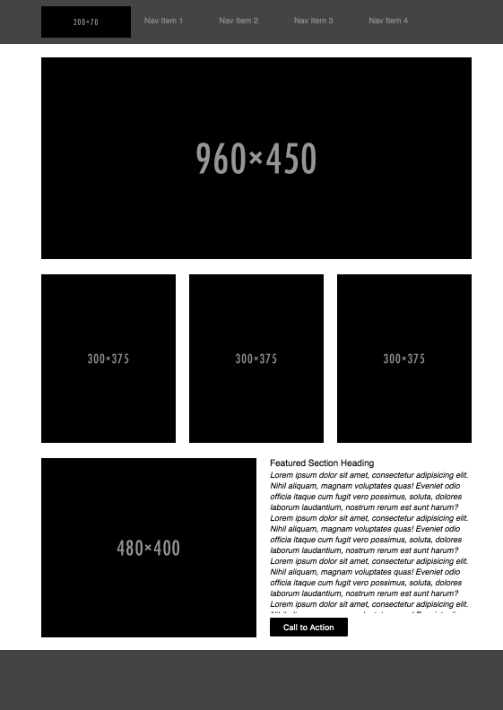
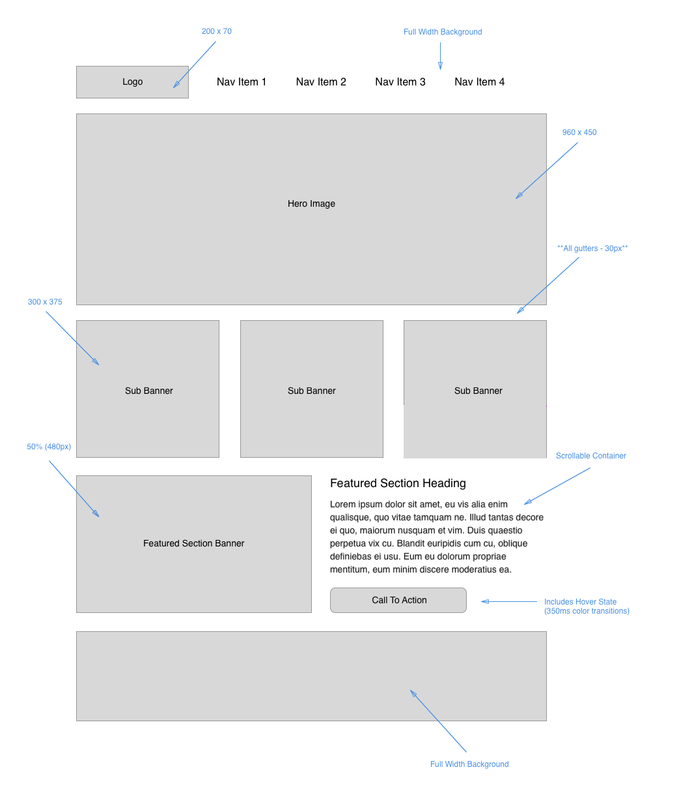

# wirefame-exercise

- [x] Create a new repo titled ‘wirefame-exercise’, making sure to configure it with index.html, style.css, and reset.css (use Eric Meyer’s reset).

Consider taking a more professional approach to web development by planning out your approach before jumping into code.

Have a design concept and a plan completely ready to go before you write the first line of code.
- [x] Build/Review a wireframe showing all document dimensions

- [x] Know where images will go and how big they will be
- [x] Use placeholder images during the setup process
- [x] Know where text will go and use placeholder lorem ipsum text
- [x] Set up the project repository, scaffold the files, and make sure they are wired together.
- [x] Build out all of the HTML without applying any classes or IDs
- [x] Working top to bottom in the document, put elements into place with CSS, using the structure of the HTML to create selectors wherever it is possible. Seek to limit use of classes and IDs to only where they are needed.
- [x] Apply color, backgrounds, borders, text styling, etc., to the specifications of the design.
- [x] After each step, be sure to “ACP” within your git work-flow.

- [x] With this wireframe in place, you can now present it to the designer and/or client for review, make any requested edits, and once there is a signoff on the wireframe, then it is time to start entering the actual content.